<!--
you opened the source. of course you did.

     ▄▄▄▄▄▄▄▄▄▄▄▄▄▄▄
    █  arlecchino  █     everything below is generated.
    █   ▄▄▄   ▄▄▄  █     nothing here was written by hand
    █   ▀▀▀   ▀▀▀  █     except the config that describes me.
    █      ▼       █
    █   ╲_______╱  █     config.yaml  →  generate.py  →  this
     ▀▀▀▀▀▀▀▀▀▀▀▀▀▀▀

if you're building your own: take it, fork it, make it yours.
-->

  
  
  
  

<code>&#9656;&nbsp; $ man aaditya</code>

 

  

<code>&#9656;&nbsp; $ uname -a</code>

 

  

<code>&#9656;&nbsp; $ cat .secrets</code>

 

  

  

<a href="mailto:flash6027@gmail.com">mail</a> &nbsp;&#183;&nbsp; <a href="https://github.com/WaifuPuller">github</a> &nbsp;&#183;&nbsp; <a href="https://www.linkedin.com/in/aaditya-singh-408968357">linkedin</a>

