<!--
╭──────────────────────────────╮
│   atlas · generated output   │
╰──────────────────────────────╯

built from a single yaml file by the same generator that
renders every other profile in this family. fork it.
-->

  
  
  
  

<code>&#9656;&nbsp; $ readme mira</code>

 

  

<code>&#9656;&nbsp; $ specs</code>

 

  

<code>&#9656;&nbsp; $ less notes.md</code>

 

  

  

<a href="mailto:mira@example.org">mail</a> &nbsp;&#183;&nbsp; <a href="https://github.com/mira-okonkwo">github</a> &nbsp;&#183;&nbsp; <a href="https://example.org/mira">papers</a>

